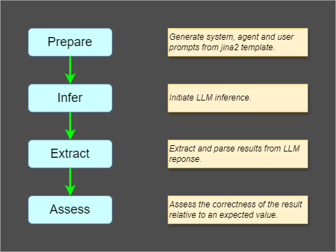
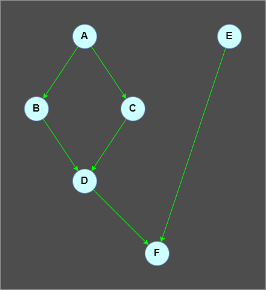

# Pipelines

<THIS DOCUMENT IS A WORK IN PROGRESS>

Every GoTaglio experiment in centered around a `pipeline`, which is a collection of processing steps, calls `stages` that are executed in a specified order. While pipeline stages can be organized into any [directed acyclic graph](https://en.wikipedia.org/wiki/Directed_acyclic_graph) or DAG, a common scenario is the linear pipeline, where the stages form a sequence.
Let's look at the steps involved in defining a linear pipeline, and then expand the concept to arbitrary DAGs.

## Defining a Linear Pipeline

The diagram, below, shows a common pattern for LLM experiments. The pipeline consists of four stages:
1. **prepare** - uses a templating system, such as [jinja2](https://jinja.palletsprojects.com/en/stable/), to generate system, agent, and user prompts, based on some `context` data structure.
2. **infer** - invoke LLM inference on the sequence of system, agent, and user messages generated in the `prepare` stage.
3. **extract** - extract and parse a result from the LLM output text. As an example, the LLM response might be the sentence, "The answer is", followed by a markdown fenced code block containing JSON. The `extract` stage might use a regex to isolaate the JSON text, and the invoke a JSON parser.
4. **assess** - compute meaningful metrics about the system performance and the quality of the answer. Might compare the answer with an expected answer or score it with other metric.

Defining this pipeline in GoTaglio involves four steps:
1. Define the configuration values for the pipeline stages.
2. Define an asynchronous worker [coroutine](https://docs.python.org/3/library/asyncio-task.html) for each stage.
3. Define pipeline initialization code.
4. Define optional methods to summarize, format, and compare runs.

### Pipeline Configuration

A pipeline configuration is a JSON-serializable dictionary with a key for each pipeline stage. Each key is bound to a dictionary of default configuration values or special `Prompt` and `Internal` marker classes.

Here's the python code for the configuration in the `simple.py` sample:

~~~python
default_config = {
    "prepare": {
        "template": Prompt("Template file for system message"),
        "template_text": Internal()
        },
    "infer": {
        "model": {
            "name": Prompt("Model name to use for inference stage"),
            "settings": {
                "max_tokens": 800,
                "temperature": 0.7,
                "top_p": 0.95,
                "frequency_penalty": 0,
                "presence_penalty": 0,
            },
        }
    },
}
~~~

Here are a few things to notice in the configuration:
* The pipeline has four stages, but the configuration only specifies values for the `prepare` and `infer` stages. The `extract` and `assess` stages are omitted because, in this example, the corresponding stage functions don't require configuration.
* The user can override or provide new configuration values on the command-line using [glom](https://glom.readthedocs.io/en/latest/)-style key bindings like `infer.model.name=gpt4o`.
* The `Prompt` marker designates a value that must be provided by the user. An error will be reported if the user does not provide a value.
* The `Internal` marker designates a value that will be added by the runtime, usually during pipeline initialization in the `Pipeline.stages()` function.

The pipeline configuration will be provided to the stage functions at runtime and it will be serialized into the run log file to facilitate replication of the experiment.

The pipeline configuration is defined in the `__init__` method of a class the derives from `Pipeline`:

~~~python
class MyPipeline(Pipeline):
  _name = "example"
  _description = "An example pipeline."

  def __init__(self, registry, replacement_config, flat_config_patch):
    # ...
    # define default_config
    # ...

    super().__init__(default_config, replacement_config, flat_config_patch)
~~~

Once `super().__init__()` returns, the patched configuration is available via the `self.config()` method.

### Asynchronous Stage Coroutines

Each stage in the pipeline is an asynchronous [coroutine](https://docs.python.org/3/library/asyncio-task.html) that takes a JSON-serializable `context` and returns a JSON-serializable `result`:
~~~python
async def f(context):
  # Do some work that sets result
  return result
~~~

The `context` data structure, which is maintained by the runtime, has information about the state of the computation so far and might look like
~~~python
{
  "case": {
    # specification for current case in a suite
  },
  "stages": {
    "prepare": {...}
    "infer": {...}
    "extract": {...}
    "assess": {...}
  },
  "metadata": {...}
}
~~~

The `case` dict is copied directly from one of the cases in the array that makes up the current suite. The format, structure, and interpretation of the `case` is defined by the stage functions that use it.

The `stages` dict is maintained by the runtime which writes the return value of each stage, as it completes.

The `metadata` dict is maintained by the runtime and contains information about the run, such as the pipeline configuration and start and end times. It also includes information about exceptions that are raised by stage functions.

The entire `context` is persisted to the run log file.

Defining a pipeline is as simple as defining a dict of stage functions:
~~~python
class MyPipeline(Pipeline):

  # ... def ___init(self, ...)___: ...

  def stages(self):
    async def f(context):
      # Do some work that sets result
      return result

    async def g(context):
      # Do some work that sets result
      return result

    async def h(context):
      # Do some work that sets result
      return result

    return {"f": f, "g": g, "h": h}
~~~

It is important to note that the stages run in the order they appear in the dict, so in the example above, stage `f` will run first, then stage `g`, then finally stage `h`.

The next code block shows a more detailed excerpt from the `stages()` method from the `simple.py` sample. 
~~~python
class SimplePipeline(Pipeline):

  # ... def ___init(self, ...)___: ...

  #
  # Define the pipeline stage functions
  #
  """
  Define the pipeline stage functions. Each stage function is a coroutine
  that takes a context dictionary as an argument.

  context["case"] has the `case` data for the current case. Typically
  this comes from the cases JSON file specified as a parameter to the
  `run` sub-command.

  context["stages"][name] has the return value for stage `name`. Note
  that context["stages"][name] will only be defined if after the stage
  has to conclusion without raising an exception.

  Note that a stage function will only be invoked if the previous stage
  has completed with a return value. 
  """

  # Create the system and user messages
  async def prepare(context):
      messages = [
          {"role": "system", "content": await template(context)},
          {"role": "user", "content": context["case"]["user"]},
      ]

      return messages

  # Invoke the model to generate a response
  async def infer(context):
      return await model.infer(context["stages"]["prepare"], context)

  # Attempt to extract a numerical answer from the model response.
  # Note that this method will raise an exception if the response is not
  # a number.
  async def extract(context):
      with ExceptionContext(f"Extracting numerical answer from LLM response."):
          return float(context["stages"]["infer"])

  # Compare the model response to the expected answer.
  async def assess(context):
      return context["stages"]["extract"] - context["case"]["answer"]

  # The pipeline stages will be executed in the order specified in the
  # dictionary returned by the stages() method. The keys of the
  # dictionary are the names of the stages.
  return {
      "prepare": prepare,
      "infer": infer,
      "extract": extract,
      "assess": assess,
  }
~~~

### Pipeline Initialization Code

In some cases it may be desirable to run expensive initializationn code, once before a run starts. While this can be done in the pipeline's `__init__()` method, the preferred location is the start of the `stages()` method. The reason is that the `stages()` method is only invoked during a `run` or `rerun`. Cases like summarizing or formatting a run log, or comparing two run logs will not incur the initialization costs.

Note that it is not a good idea to lazily initialize resources inside the stage coroutines, because exceptions thrown during initialization should really be raised and reported to the user before the case-by-case run processing commences. An common reason for initializtion is a user typo in a model name, specified on the command-line.

Some common initializations are
* initializing [tiktoken](https://cookbook.openai.com/examples/how_to_count_tokens_with_tiktoken)
* compiling [jinga2](https://jinja.palletsprojects.com/en/stable/) templates
* initializing models

Here's the relevant excerpt from `simple.py`:

~~~python
def stages(self):
  #
  # Perform some setup here so that any initialization errors encountered
  # are caught before running the cases.
  #

  # Compile the jinja2 template used in the `prepare` stage.
  template = build_template(
    self.config(),
    "prepare.template",
    "prepare.template_text",
  )

  # Instantiate the model for the `infer` stage.
  model = self._registry.model(glom(self.config(), "infer.model.name"))

  #
  # ... Define the pipeline stage functions  ...
  #
~~~

### Summarize, Format and Compare Methods

## Defining a General DAG Pipeline

In the previous section, we showed a shorthand for defining a linear pipeline, using a dict of asychronous coroutines. One can define arbitrary [DAGs](https://en.wikipedia.org/wiki/Directed_acyclic_graph), using an array of `node` specifications which have the form
~~~python
node = {
  "name": "d",
  "function": d,
  "inputs": ["b", "c"]
}
~~~

A pipeline can define a DAG by returning an array of node specifications, instead of a dictionary of stages.

Consider the following DAG.

Given functions `a, b, c, d, e`, and `f` that DAG can be specified as
~~~python
def stages(self):
  return [
    {"name": "A", "function": a, "inputs": []},
    {"name": "B", "function": b, "inputs": ["A"]},
    {"name": "C", "function": c, "inputs": ["A"]},
    {"name": "D", "function": d, "inputs": ["B", "C"]},
    {"name": "E", "function": e, "inputs": []},
    {"name": "F", "function": f, "inputs": ["D", "E"]},
  ]
~~~
